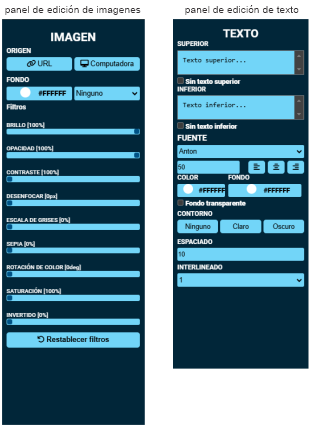

<!-- ***************PRESENTACION**************** -->

  

***
# 
 María Carolina Sasowsky

### 
 Diseñadora Gráfica | Desarrolladora Web Frontend | Mgter. en Diseño Editorial

***

#### ¡Hola!
En la actualidad, las aplicaciones web, también conocidas como apps, han adquirido un papel fundamental en nuestra vida cotidiana. Estas herramientas no solo simplifican las tareas diarias, sino que también aportan una dosis significativa de entretenimiento. Un ejemplo destacado que refleja esta dualidad funcional es el Generador de Memes, una aplicación web que no solo se limita a ser una plataforma divertida, sino que también permite a los usuarios explorar y expresar su creatividad de manera única.

  

El Generador de Memes ha sido concebido de manera que su funcionamiento sea posible en una variedad de dispositivos, lo que implica que cuenta con un diseño responsivo adecuado.

  

Éste trabajo se elaboró como el proyecto final del "Módulo 2 - JavaScript" en el marco del programa de formación en "Desarrollo Frontend" ofrecido por ADA ITW. Este trabajo está integrado en mi Portafolio Personal con el fin de demostrar el nivel de avance, comprensión y aplicación de los conocimientos adquiridos a lo largo de la capacitación.

***
### 
TECNOLOGIAS UTILIZADAS

  

***
### 
FUNCIONAMIENTO

El Generador de Memes muestra en su pantalla principal tres botones que posibilitan acceder al panel de edición de imágenes, abrir el panel de edición de texto y cambiar entre el Modo Claro y el Modo Oscuro.

  

Además de la personalización de contenido, el Generador de Memes ofrece una variedad de filtros que permiten jugar con la estética visual, agregando un toque distintivo a cada creación. Una vez finalizado el proceso creativo, la aplicación permite guardar y/o descargar el meme elaborado, proporcionando la opción de compartir la creación con amigos y contactos en diferentes plataformas.

  

El Generador de Memes ofrece a cualquier usuario la oportunidad de sumergirse en el mundo de la creación visual, específicamente en el ámbito de los memes. Este recurso posibilita la inclusión de imágenes, ya sean propias o provenientes de la web, permitiendo así a los usuarios personalizar sus memes de manera singular. La edición del texto es completamente flexible, brindando libertad para plasmar mensajes ingeniosos o reflexivos según las preferencias de cada usuario.

  

En resumen, el Generador de Memes no solo es una herramienta para el entretenimiento, sino también un espacio que te invita a explorar tu expresión individual y creatividad. Ofrece una experiencia integral y personalizada en la creación de contenido visual humorístico. ¿Te gustaría conocer más? ¡Haz clic en el siguiente enlace para explorar el proyecto en detalle! Conoce más: https://carolinasasowsky.github.io/generadorDeMemes/